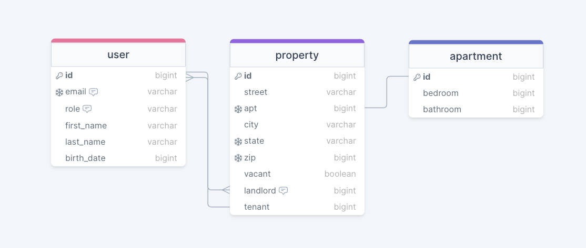

# inHome-FullStack
## DATABASE  

## PITCH

- A real estate rental property managing web-app that allows for a landlord to sign up, manage their rental property, and invite/choose candidates/applicants. Once the landlord chooses a specific applicant to complete a lease contract, the tenant has access to viewing the lease and sending in repair requests or general inquiries to the landlord while a tenant at the property. 

## CRUD

- Users on either side will create profiles and interact with forms to fill out and save in a database. A landlord will be able to select optios for a lease contract that details what is or isn't allowed. 

- The applicant/tenant will be able to add details to an applicaiton, update any personla contact information, create repair requests or service requests, track the requests, and close or delete. 

## AUTHENTICATION 
    
- All users will be able to register, log in, and log out to this application.

## APIs 

- SmartyStreets Address Validation API  
- BigCloudData email address and server validation API
