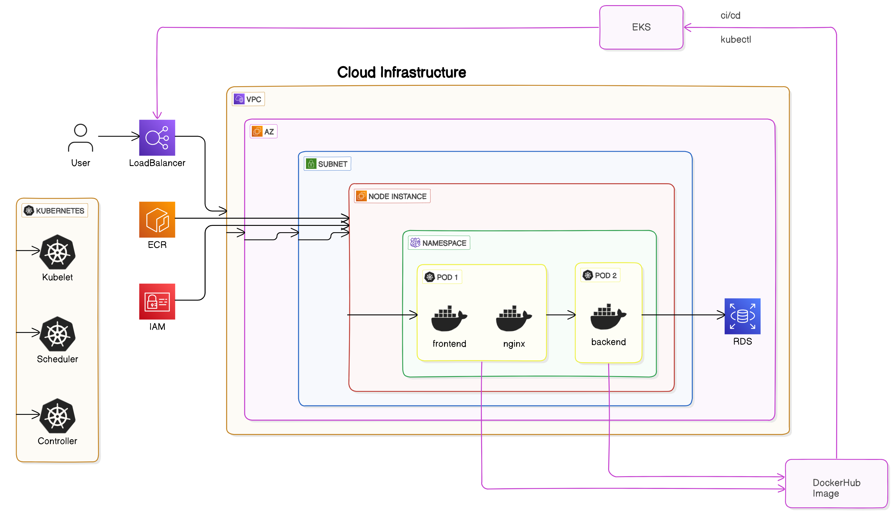
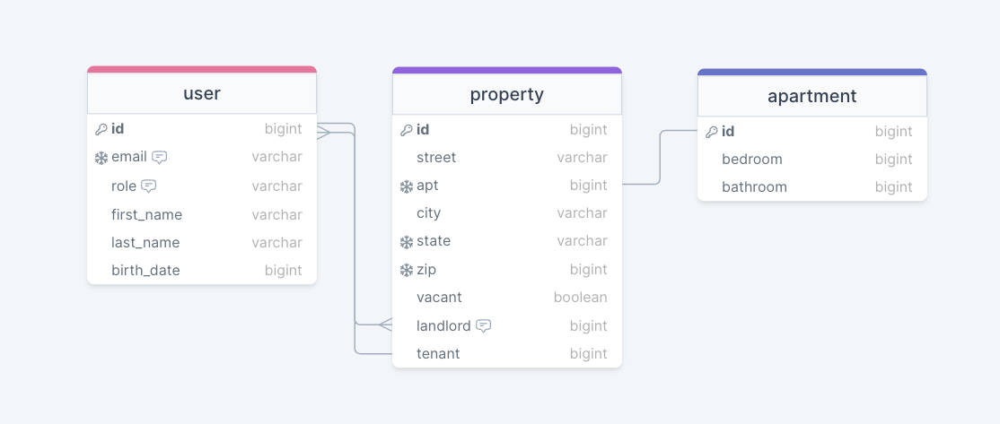

# 🏡 inHome: Scalable Cloud Architecture on AWS

Welcome to **inHome**, a cloud-native application powered by AWS, Kubernetes, Docker, and PostgreSQL. This README provides a high-level overview of the infrastructure components and deployment workflow behind our scalable and resilient architecture in the cloud. 

This DevOps Capstone was done with the following team members:

[Errick Basa-Denis](https://github.com/errickbd)

[Jose Sandoval](https://github.com/SWSand)

[Neka Blair](https://github.com/nekablair)

## APPLICATION ARCHITECTURE

- This is an overview of the cloud infrastructure for inHome. The diagram below exhibits the AWS Cloud Architecture used to deploy our application.



## DATABASE  


## 🚀 Components

### 🏞 AWS Cloud
- **Region:** us-east-1
- **Overview:** Root layer that encapsulates all infrastructure components within AWS.

### 🛡 VPC (Virtual Private Cloud)
- **Purpose:** Isolated network where our application resides, partitioned from the rest of AWS.

### 📦 Subnets
- **High Availability:** Segments of our VPC that distribute resources across different Availability Zones (AZs) for redundancy and fault tolerance.

### 🎛 Load Balancers
1. **Application Load Balancer (ALB)**: Distributes incoming application traffic across EC2 instances and multiple Availability Zones.

### ☸️ EKS Cluster
- **Kubernetes Management**: Manages our Kubernetes deployments and services.

### 🖥 Node Instances
- **EC2 Instances**: The backbone of our Kubernetes nodes.

### 🐳 Pods
- **Containers in Action**: Group of one or more containers deployed across nodes, including:
  - **Frontend**: `inHome-frontend` (React app)
  - **Backend**: `inHome-backend` (Django app)
  - **Database**: `postgres` (PostgreSQL DB)

### 📒 etcd
- **Kubernetes Database**: A key-value store that keeps track of all Kubernetes cluster data.

### 🛠 Controllers & Scheduler
- **Kubernetes Components**: Ensure pods and services reach their desired state.

### 🌐 API Server
- **Kubernetes API**: Exposes the Kubernetes API for managing and interacting with the cluster.

### 🐋 Docker Hub
- **Image Repository**: Stores our application images for easy access and deployment.

---

## 📁 File Structure

```bash
inHome/
├── k8s/
│   ├── backend-deployment.yaml
│   ├── frontend-deployment.yaml
│   ├── postgres-deployment.yaml
│   └── services/
│       ├── backend-service.yaml
│       ├── frontend-service.yaml
│       └── postgres-service.yaml
├── docker/
│   ├── Dockerfile-backend
│   ├── Dockerfile-frontend
│   └── Dockerfile-postgres
├── src/
│   ├── backend/ # Django app
│   └── frontend/ # React app
└── README.md
```
---

## 🛠 Workflow

### 🛑 **Development and Provisioning**
1. 🏗 Developers build the Docker images for the application components.
2. 📤 Images are pushed to **Docker Hub**.

### 🚀 **Deployment**
- Kubernetes pulls the necessary images from Docker Hub and deploys them as pods in the EKS cluster.

### 👩‍💻 **User Interaction**
- **ALB** routes user requests to the appropriate services running in the cluster for a smooth user experience.

---

## 🛠 Deployment and Debugging Strategy

### 🎨 **Building the Application**
- We start by building Docker images for the **frontend** (React) and **backend** (Django) along with the **PostgreSQL database**.
- After testing locally (via Minikube) and debugging, we push the images to **Docker Hub**.

### 🚀 **Deployment on AWS EKS**
- Images from Docker Hub are pulled by **Kubernetes** and deployed in our EKS cluster.
- Kubernetes configurations handle services, deployments, and load balancers, ensuring high availability and smooth traffic management.

### 📡 **Kubernetes & AWS Services Configuration**
- **Elastic Load Balancers (ELB)** handle traffic and route it to the appropriate pods running on Kubernetes.
  - Backend service listens on **port 8000**.
  - Frontend service listens on **port 5173**.
  
These configurations ensure seamless communication between users and our application, enhancing the overall user experience.

---

## ☸️ EKS Management

**AWS EKS** simplifies Kubernetes deployment and management by offering a highly available, secure, and scalable infrastructure. With EKS, we don’t have to worry about managing the control plane or worker nodes, letting AWS handle it while we focus on our application.

- **Integration**: EKS integrates with other AWS services for logging, monitoring, and security (CloudWatch, IAM, etc.).
  
---

## 🎯 Conclusion

inHome’s cloud infrastructure is built on modern technologies like **Kubernetes**, **Docker**, and **AWS** to ensure scalability, high availability, and ease of management. We hope this README helps you understand our architecture and deployment strategy.

For a detailed guide on setting up and deploying this infrastructure, check out the documentation available in this repository. 📚

---

## 📁 Supplementary Documentation
- Detailed setup instructions
- Best practices for scaling and maintaining the infrastructure

📌 We encourage you to explore the supplementary documentation for a more in-depth understanding of inHome's cloud environment!